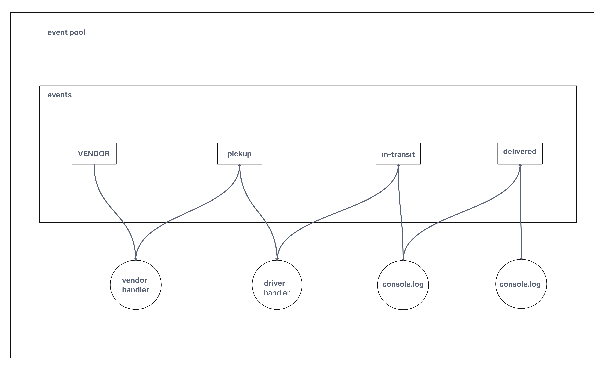

# LAB - Class 11

## Project: Event Programming

### Authors: Joe Davitt

Collaborators:
Jordan
Ty
Adrienne
Steve

### Problem Domain

Create a caps system

### Links and Resources

[Actions](https://github.com/j-davitt/caps/actions)

### Setup

#### `.env` requirements (where applicable)

no env requirements

#### How to initialize/run your application (where applicable)

- e.g. `npm start`

#### UML

