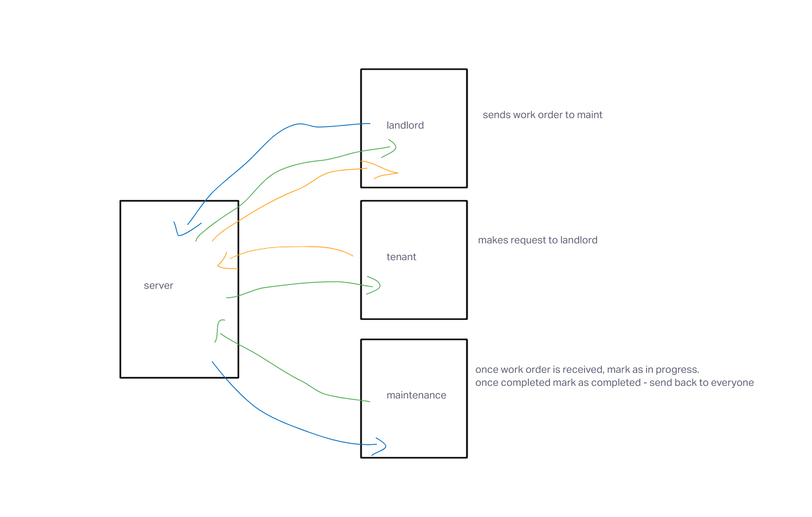

# LAB - Class 14

## Project: Event Programming

### Authors: Joe Davitt and Yen Xiong Yuan

Referenced live demo to help with some issues we had accessing the correct Queues and removing objects.

### Problem Domain

A system that will take a request from a tenant, send it to the landlord and allow the landlord to send a work order to maintenance. Maintenance will then send a progress, and eventually a completed work order.

### Links and Resources

[Actions](https://github.com/j-davitt/lab14/actions)

### Setup

#### `.env` requirements (where applicable)

PORT=3001

#### How to initialize/run your application (where applicable)

- e.g. `npm start`

#### UML

